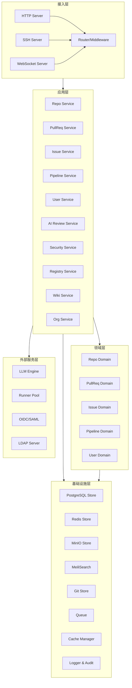
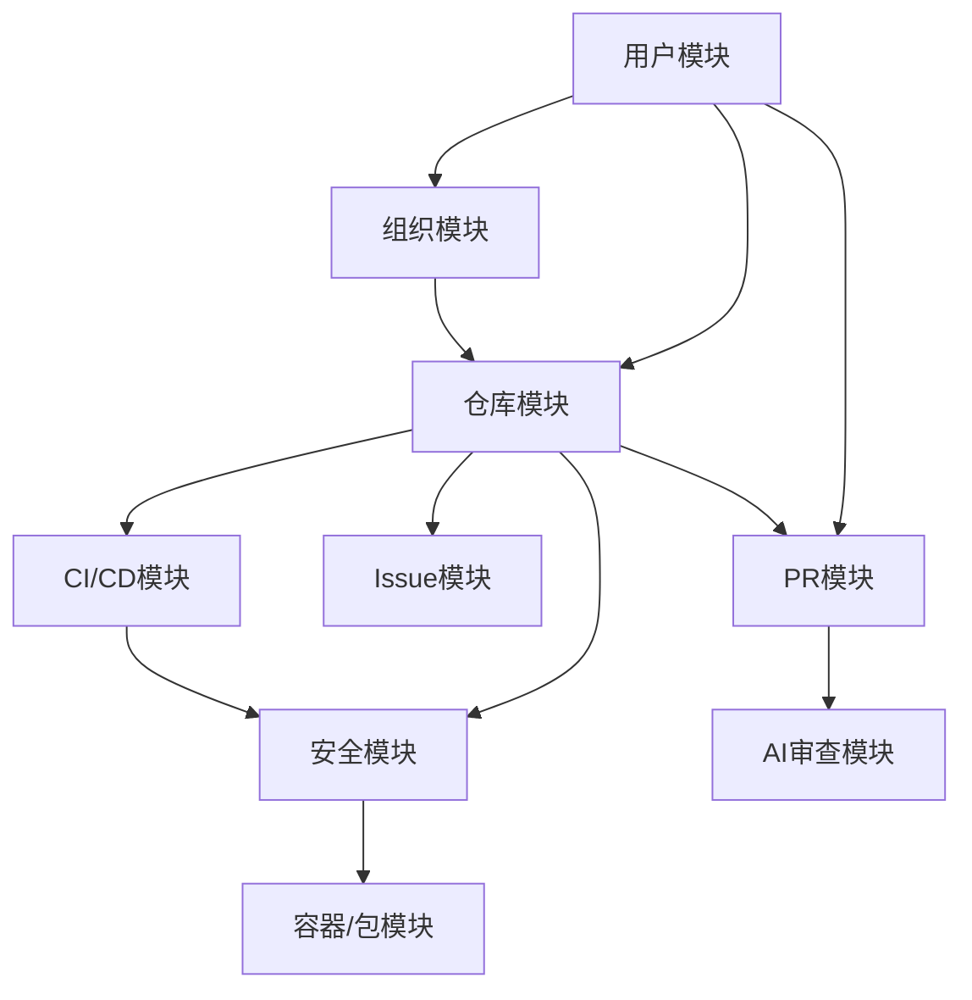

# Laima（莱码）软件设计规范

> **版本**：v1.0
> **日期**：2026 年 4 月 22 日
> **基于**：《Laima（莱码）产品方案》、《Laima（莱码）软件架构设计与系统功能设计》

## 1. 仓库分析

### 1.1 项目概述

Laima（莱码）是一款 AI 原生的轻量级全功能代码托管平台，融合 Gerrit 级严格代码审查与 GitLab 级完整 DevSecOps 能力，以 Go + Rust 高性能技术栈实现 1GB RAM 即可运行的企业级平台。

### 1.2 核心功能

| 模块 | 核心功能 | 优先级 |
|------|----------|--------|
| 代码托管 | Git 仓库管理、分支管理、标签管理、代码搜索、Git LFS | P0 |
| Pull Request | PR 创建/合并、内联评论、审批规则、合并策略、AI 智能审查 | P0 |
| CI/CD | 流水线定义、Runner 管理、矩阵构建、缓存机制 | P0 |
| Issue 追踪 | Issue 管理、看板视图、里程碑、时间追踪 | P0 |
| 安全扫描 | SAST、依赖扫描、密钥检测、许可证合规 | P1 |
| 容器/包管理 | Container Registry、Package Registry | P1 |
| Wiki | 项目 Wiki、Pages、Mermaid 图表 | P1 |
| 权限管理 | 角色体系、仓库级权限、SSO/SAML、LDAP、审计日志 | P0 |

### 1.3 技术栈

| 类别 | 技术 | 版本 | 用途 |
|------|------|------|------|
| 后端语言 | Go | 1.22+ | 主服务、API 层、业务逻辑 |
| 后端语言 | Rust | 1.75+ | AI/安全扫描引擎 |
| 前端框架 | Vue | 3.4+ | 前端界面 |
| 前端语言 | TypeScript | 5.3+ | 前端开发 |
| 数据库 | PostgreSQL | 16+ | 主数据库 |
| 缓存/队列 | Redis | 7.2+ | 缓存、消息队列 |
| 搜索引擎 | Meilisearch | 1.6+ | 代码搜索 |
| 对象存储 | MinIO | latest | Git LFS、制品存储 |
| Git 库 | go-git | latest | 纯 Go Git 实现 |
| AI 推理 | Ollama + 云端 API | latest | AI 审查 |

## 2. 技术架构设计

### 2.1 架构风格

采用**改良的分层单体架构**（Modular Monolith），在保持单一进程部署优势的同时，通过清晰的模块边界实现高内聚低耦合。

### 2.2 系统分层



### 2.3 核心模块依赖关系



### 2.4 关键设计原则

1. **轻量优先**：最小化资源占用，512MB RAM 可运行核心功能
2. **模块化**：功能模块高内聚低耦合，可独立开发和测试
3. **可扩展**：支持水平扩展和功能插件化
4. **安全内建**：安全不是附加层，而是贯穿所有层级的设计
5. **AI 原生**：AI 能力深度集成到核心流程中，而非外挂
6. **兼容性**：兼容 GitHub API 格式和 CI/CD 语法

## 3. 前端架构设计

### 3.1 技术栈

- **框架**：Vue 3 + TypeScript + Vite
- **状态管理**：Pinia
- **路由**：Vue Router
- **UI 组件**：自研组件库（基于 Radix Vue）
- **代码编辑器**：Monaco Editor
- **HTTP 客户端**：Axios
- **样式**：CSS Modules + PostCSS
- **构建工具**：Vite

### 3.2 目录结构

```
frontend/
├── public/              # 静态资源
├── src/
│   ├── assets/         # 图片、字体等
│   ├── components/     # 通用组件
│   │   ├── ui/         # 基础 UI 组件
│   │   ├── layout/     # 布局组件
│   │   └── common/     # 业务通用组件
│   ├── views/          # 页面组件
│   │   ├── repo/       # 仓库相关页面
│   │   ├── pr/         # PR 相关页面
│   │   ├── issue/      # Issue 相关页面
│   │   ├── pipeline/   # CI/CD 相关页面
│   │   ├── security/   # 安全相关页面
│   │   ├── user/       # 用户相关页面
│   │   └── org/        # 组织相关页面
│   ├── router/         # 路由配置
│   ├── store/          # Pinia 状态管理
│   ├── services/       # API 服务
│   ├── utils/          # 工具函数
│   ├── hooks/          # 自定义 Hooks
│   ├── constants/      # 常量定义
│   ├── types/          # TypeScript 类型定义
│   ├── App.vue         # 根组件
│   └── main.ts         # 入口文件
├── index.html          # HTML 模板
├── tsconfig.json       # TypeScript 配置
├── vite.config.ts      # Vite 配置
└── package.json        # 依赖配置
```

### 3.3 核心功能模块

#### 3.3.1 代码审查页面

- **功能**：PR 查看、代码 Diff 展示、内联评论、AI 审查结果展示
- **组件**：PRHeader、AISummary、FileList、CodeDiff、ReviewPanel
- **状态管理**：PRStore、ReviewStore
- **API**：`/api/v1/repos/{owner}/{repo}/pulls/{number}`

#### 3.3.2 项目仪表盘

- **功能**：活动概览、最近 PR/Issue、仓库列表
- **组件**：DashboardHeader、ActivityOverview、RecentActivity、RepoList
- **状态管理**：DashboardStore
- **API**：`/api/v1/user/dashboard`

#### 3.3.3 仓库管理页面

- **功能**：仓库列表、仓库详情、分支管理、标签管理
- **组件**：RepoList、RepoDetail、BranchManager、TagManager
- **状态管理**：RepoStore
- **API**：`/api/v1/repos`

### 3.4 前端性能优化

1. **代码分割**：使用 Vite 的动态导入实现路由级代码分割
2. **组件懒加载**：大型组件（如代码编辑器）懒加载
3. **缓存策略**：合理使用浏览器缓存和本地存储
4. **虚拟列表**：长列表（如文件树、PR 列表）使用虚拟滚动
5. **WebWorker**：将大型计算（如代码高亮）移至 WebWorker
6. **CDN 加速**：静态资源使用 CDN 分发

## 4. 后端架构设计

### 4.1 模块划分

```
backend/
├── cmd/
│   └── laima/          # 主程序入口
│       └── main.go
├── internal/
│   ├── repo/           # 仓库管理模块
│   ├── pullreq/        # Pull Request 模块
│   ├── issue/          # Issue 追踪模块
│   ├── pipeline/       # CI/CD 流水线模块
│   ├── user/           # 用户管理模块
│   ├── org/            # 组织管理模块
│   ├── aireview/       # AI 审查引擎模块
│   ├── security/       # 安全扫描模块
│   ├── registry/       # 容器/包仓库模块
│   └── wiki/           # Wiki 模块
├── pkg/                # 公共包
│   ├── auth/           # 认证鉴权
│   ├── middleware/     # 中间件
│   ├── git/            # Git 操作封装
│   ├── llm/            # LLM 客户端封装
│   ├── queue/          # 消息队列封装
│   ├── cache/          # 缓存封装
│   ├── search/         # 搜索封装
│   ├── storage/        # 对象存储封装
│   ├── crypto/         # 加密工具
│   └── notification/   # 通知服务
├── configs/            # 配置文件
├── scripts/            # 脚本文件
├── go.mod              # Go 模块定义
└── go.sum              # 依赖版本锁定
```

### 4.2 核心模块设计

#### 4.2.1 仓库管理模块

**领域模型**：
- Repository：仓库实体
- Branch：分支实体
- Tag：标签实体
- BranchProtection：分支保护规则

**应用服务**：
- RepoService：仓库 CRUD、Fork、导入、分支/标签管理
- GitOperations：Git 操作封装

**API 接口**：
- `GET /api/v1/repos/{owner}/{repo}`
- `POST /api/v1/repos`
- `PUT /api/v1/repos/{owner}/{repo}`
- `DELETE /api/v1/repos/{owner}/{repo}`

#### 4.2.2 Pull Request 模块

**领域模型**：
- PullRequest：PR 实体
- Review：审查记录
- ReviewComment：审查评论

**应用服务**：
- PullReqService：PR 生命周期管理、审查操作、合并操作

**API 接口**：
- `GET /api/v1/repos/{owner}/{repo}/pulls`
- `POST /api/v1/repos/{owner}/{repo}/pulls`
- `GET /api/v1/repos/{owner}/{repo}/pulls/{number}`
- `POST /api/v1/repos/{owner}/{repo}/pulls/{number}/reviews`

#### 4.2.3 AI 审查引擎模块

**核心组件**：
- Review Orchestrator：审查编排器
- Change Analyzer：变更分析器
- Context Builder：上下文构建器
- Analyzer Pool：分析器池（Bug、Security、Perf、Style）
- Result Aggregator：结果聚合器
- Review Publisher：审查发布器
- LLM Provider：LLM 提供者抽象层

**API 接口**：
- `GET /api/v1/repos/{owner}/{repo}/pulls/{number}/ai-review`
- `POST /api/v1/repos/{owner}/{repo}/pulls/{number}/ai-review/trigger`

#### 4.2.4 CI/CD 流水线模块

**领域模型**：
- Pipeline：流水线实体
- Job：任务实体
- Runner：执行器实体

**应用服务**：
- PipelineService：流水线解析、创建、调度
- RunnerService：Runner 注册、任务执行

**API 接口**：
- `GET /api/v1/repos/{owner}/{repo}/pipelines`
- `POST /api/v1/repos/{owner}/{repo}/pipelines/trigger`
- `GET /api/v1/repos/{owner}/{repo}/pipelines/{id}/jobs`

#### 4.2.5 安全扫描模块

**核心功能**：
- SAST 扫描
- 依赖扫描
- 密钥检测
- 许可证检查
- DAST 扫描（专业版）
- 容器扫描（专业版）

**API 接口**：
- `GET /api/v1/repos/{owner}/{repo}/security/scans`
- `POST /api/v1/repos/{owner}/{repo}/security/scan/trigger`

### 4.3 技术实现要点

1. **Go 模块设计**：使用 Go 1.22+ 模块系统，采用依赖注入模式
2. **并发处理**：合理使用 goroutine 和 channel 处理并发任务
3. **错误处理**：统一错误处理机制，返回标准化错误响应
4. **日志系统**：结构化日志，支持不同级别和输出格式
5. **配置管理**：分层配置（默认配置 + 环境变量 + 命令行参数）
6. **健康检查**：提供健康检查接口，用于监控和容器编排

## 5. 数据库与数据结构设计

### 5.1 数据库表结构

#### 5.1.1 用户表 (`users`)

| 字段名 | 数据类型 | 约束 | 描述 |
|--------|----------|------|------|
| `id` | `SERIAL` | `PRIMARY KEY` | 用户 ID |
| `username` | `VARCHAR(255)` | `UNIQUE NOT NULL` | 用户名 |
| `email` | `VARCHAR(255)` | `UNIQUE NOT NULL` | 邮箱 |
| `password_hash` | `VARCHAR(255)` | `NOT NULL` | 密码哈希 |
| `avatar_url` | `VARCHAR(512)` | | 头像 URL |
| `bio` | `TEXT` | | 个人简介 |
| `settings` | `JSONB` | | 用户设置 |
| `created_at` | `TIMESTAMP` | `NOT NULL DEFAULT NOW()` | 创建时间 |
| `updated_at` | `TIMESTAMP` | `NOT NULL DEFAULT NOW()` | 更新时间 |

#### 5.1.2 组织表 (`organizations`)

| 字段名 | 数据类型 | 约束 | 描述 |
|--------|----------|------|------|
| `id` | `SERIAL` | `PRIMARY KEY` | 组织 ID |
| `name` | `VARCHAR(255)` | `UNIQUE NOT NULL` | 组织名 |
| `display_name` | `VARCHAR(255)` | | 显示名称 |
| `description` | `TEXT` | | 组织描述 |
| `owner_id` | `INTEGER` | `REFERENCES users(id)` | 所有者 ID |
| `settings` | `JSONB` | | 组织设置 |
| `created_at` | `TIMESTAMP` | `NOT NULL DEFAULT NOW()` | 创建时间 |
| `updated_at` | `TIMESTAMP` | `NOT NULL DEFAULT NOW()` | 更新时间 |

#### 5.1.3 仓库表 (`repositories`)

| 字段名 | 数据类型 | 约束 | 描述 |
|--------|----------|------|------|
| `id` | `SERIAL` | `PRIMARY KEY` | 仓库 ID |
| `name` | `VARCHAR(255)` | `NOT NULL` | 仓库名 |
| `full_path` | `VARCHAR(512)` | `UNIQUE NOT NULL` | 完整路径 (owner/repo) |
| `description` | `TEXT` | | 仓库描述 |
| `owner_type` | `VARCHAR(50)` | `NOT NULL` | 所有者类型 (user/org) |
| `owner_id` | `INTEGER` | `NOT NULL` | 所有者 ID |
| `visibility` | `VARCHAR(50)` | `NOT NULL DEFAULT 'private'` | 可见性 |
| `default_branch` | `VARCHAR(255)` | `NOT NULL DEFAULT 'main'` | 默认分支 |
| `size` | `BIGINT` | `NOT NULL DEFAULT 0` | 仓库大小 |
| `is_fork` | `BOOLEAN` | `NOT NULL DEFAULT false` | 是否为 Fork |
| `fork_parent_id` | `INTEGER` | `REFERENCES repositories(id)` | Fork 源仓库 ID |
| `is_mirror` | `BOOLEAN` | `NOT NULL DEFAULT false` | 是否为镜像 |
| `mirror_url` | `VARCHAR(512)` | | 镜像源 URL |
| `settings` | `JSONB` | | 仓库设置 |
| `created_at` | `TIMESTAMP` | `NOT NULL DEFAULT NOW()` | 创建时间 |
| `updated_at` | `TIMESTAMP` | `NOT NULL DEFAULT NOW()` | 更新时间 |

#### 5.1.4 Pull Request 表 (`pull_requests`)

| 字段名 | 数据类型 | 约束 | 描述 |
|--------|----------|------|------|
| `id` | `SERIAL` | `PRIMARY KEY` | PR ID |
| `number` | `INTEGER` | `NOT NULL` | PR 编号 |
| `title` | `VARCHAR(512)` | `NOT NULL` | 标题 |
| `description` | `TEXT` | | 描述 |
| `repository_id` | `INTEGER` | `REFERENCES repositories(id)` | 仓库 ID |
| `author_id` | `INTEGER` | `REFERENCES users(id)` | 作者 ID |
| `source_repo_id` | `INTEGER` | `REFERENCES repositories(id)` | 源仓库 ID |
| `source_branch` | `VARCHAR(255)` | `NOT NULL` | 源分支 |
| `target_branch` | `VARCHAR(255)` | `NOT NULL` | 目标分支 |
| `state` | `VARCHAR(50)` | `NOT NULL DEFAULT 'open'` | 状态 |
| `merge_state` | `VARCHAR(50)` | `NOT NULL DEFAULT 'checking'` | 合并状态 |
| `review_mode` | `VARCHAR(50)` | `NOT NULL DEFAULT 'standard'` | 审查模式 |
| `head_commit_sha` | `VARCHAR(40)` | `NOT NULL` | 头部提交 SHA |
| `base_commit_sha` | `VARCHAR(40)` | `NOT NULL` | 基础提交 SHA |
| `merge_commit_sha` | `VARCHAR(40)` | | 合并提交 SHA |
| `merged_by` | `INTEGER` | `REFERENCES users(id)` | 合并者 ID |
| `merged_at` | `TIMESTAMP` | | 合并时间 |
| `closed_at` | `TIMESTAMP` | | 关闭时间 |
| `is_draft` | `BOOLEAN` | `NOT NULL DEFAULT false` | 是否为草稿 |
| `ai_review_status` | `VARCHAR(50)` | `NOT NULL DEFAULT 'pending'` | AI 审查状态 |
| `created_at` | `TIMESTAMP` | `NOT NULL DEFAULT NOW()` | 创建时间 |
| `updated_at` | `TIMESTAMP` | `NOT NULL DEFAULT NOW()` | 更新时间 |

#### 5.1.5 审查评论表 (`review_comments`)

| 字段名 | 数据类型 | 约束 | 描述 |
|--------|----------|------|------|
| `id` | `SERIAL` | `PRIMARY KEY` | 评论 ID |
| `pull_request_id` | `INTEGER` | `REFERENCES pull_requests(id)` | PR ID |
| `review_id` | `INTEGER` | `REFERENCES reviews(id)` | 审查 ID |
| `author_id` | `INTEGER` | `REFERENCES users(id)` | 作者 ID |
| `type` | `VARCHAR(50)` | `NOT NULL DEFAULT 'human'` | 评论类型 (human/ai) |
| `path` | `VARCHAR(512)` | `NOT NULL` | 文件路径 |
| `line` | `INTEGER` | | 行号 |
| `diff_hunk` | `TEXT` | | Diff 片段 |
| `body` | `TEXT` | `NOT NULL` | 评论内容 |
| `resolution` | `VARCHAR(50)` | | 解决状态 |
| `suggestion` | `TEXT` | | 建议式修改内容 |
| `created_at` | `TIMESTAMP` | `NOT NULL DEFAULT NOW()` | 创建时间 |
| `updated_at` | `TIMESTAMP` | `NOT NULL DEFAULT NOW()` | 更新时间 |

#### 5.1.6 Issue 表 (`issues`)

| 字段名 | 数据类型 | 约束 | 描述 |
|--------|----------|------|------|
| `id` | `SERIAL` | `PRIMARY KEY` | Issue ID |
| `number` | `INTEGER` | `NOT NULL` | Issue 编号 |
| `title` | `VARCHAR(512)` | `NOT NULL` | 标题 |
| `description` | `TEXT` | | 描述 |
| `repository_id` | `INTEGER` | `REFERENCES repositories(id)` | 仓库 ID |
| `author_id` | `INTEGER` | `REFERENCES users(id)` | 作者 ID |
| `assignee_id` | `INTEGER` | `REFERENCES users(id)` | 指派人 ID |
| `state` | `VARCHAR(50)` | `NOT NULL DEFAULT 'open'` | 状态 |
| `milestone_id` | `INTEGER` | `REFERENCES milestones(id)` | 里程碑 ID |
| `labels` | `JSONB` | | 标签 |
| `priority` | `VARCHAR(50)` | | 优先级 |
| `created_at` | `TIMESTAMP` | `NOT NULL DEFAULT NOW()` | 创建时间 |
| `updated_at` | `TIMESTAMP` | `NOT NULL DEFAULT NOW()` | 更新时间 |

#### 5.1.7 流水线表 (`pipelines`)

| 字段名 | 数据类型 | 约束 | 描述 |
|--------|----------|------|------|
| `id` | `SERIAL` | `PRIMARY KEY` | 流水线 ID |
| `repository_id` | `INTEGER` | `REFERENCES repositories(id)` | 仓库 ID |
| `commit_sha` | `VARCHAR(40)` | `NOT NULL` | 提交 SHA |
| `ref` | `VARCHAR(255)` | `NOT NULL` | 分支/标签 |
| `status` | `VARCHAR(50)` | `NOT NULL DEFAULT 'pending'` | 状态 |
| `trigger` | `VARCHAR(50)` | `NOT NULL` | 触发方式 |
| `yaml_content` | `TEXT` | | 流水线配置 |
| `duration` | `INTEGER` | | 执行时长 (秒) |
| `created_at` | `TIMESTAMP` | `NOT NULL DEFAULT NOW()` | 创建时间 |
| `updated_at` | `TIMESTAMP` | `NOT NULL DEFAULT NOW()` | 更新时间 |

#### 5.1.8 安全扫描表 (`security_scans`)

| 字段名 | 数据类型 | 约束 | 描述 |
|--------|----------|------|------|
| `id` | `SERIAL` | `PRIMARY KEY` | 扫描 ID |
| `repository_id` | `INTEGER` | `REFERENCES repositories(id)` | 仓库 ID |
| `commit_sha` | `VARCHAR(40)` | `NOT NULL` | 提交 SHA |
| `scan_type` | `VARCHAR(50)` | `NOT NULL` | 扫描类型 |
| `status` | `VARCHAR(50)` | `NOT NULL DEFAULT 'pending'` | 状态 |
| `severity` | `VARCHAR(50)` | | 最高严重性 |
| `findings` | `JSONB` | | 发现结果 |
| `duration` | `INTEGER` | | 执行时长 (秒) |
| `created_at` | `TIMESTAMP` | `NOT NULL DEFAULT NOW()` | 创建时间 |
| `updated_at` | `TIMESTAMP` | `NOT NULL DEFAULT NOW()` | 更新时间 |

### 5.2 数据传输对象 (DTOs)

#### 5.2.1 仓库相关 DTOs

```go
// CreateRepoRequest 创建仓库请求
type CreateRepoRequest struct {
    Name        string      `json:"name" binding:"required"`
    Description string      `json:"description"`
    Visibility  string      `json:"visibility" binding:"omitempty,oneof=public private internal"`
    IsPrivate   bool        `json:"is_private"`
    AutoInit    bool        `json:"auto_init"`
    GitignoreTemplate string `json:"gitignore_template"`
    LicenseTemplate string   `json:"license_template"`
}

// RepositoryResponse 仓库响应
type RepositoryResponse struct {
    ID           int64          `json:"id"`
    Name         string         `json:"name"`
    FullName     string         `json:"full_name"`
    Description  string         `json:"description"`
    Owner        OwnerResponse  `json:"owner"`
    Visibility   string         `json:"visibility"`
    DefaultBranch string        `json:"default_branch"`
    SSHURL       string         `json:"ssh_url"`
    HTTPSURL     string         `json:"https_url"`
    CreatedAt    time.Time      `json:"created_at"`
    UpdatedAt    time.Time      `json:"updated_at"`
}
```

#### 5.2.2 PR 相关 DTOs

```go
// CreatePRRequest 创建 PR 请求
type CreatePRRequest struct {
    Title        string `json:"title" binding:"required"`
    Description  string `json:"description"`
    Head         string `json:"head" binding:"required"` // 格式: owner:branch
    Base         string `json:"base" binding:"required"` // 格式: branch
    MaintainerCanModify bool `json:"maintainer_can_modify"`
    Draft        bool   `json:"draft"`
}

// PullRequestResponse PR 响应
type PullRequestResponse struct {
    ID           int64            `json:"id"`
    Number       int64            `json:"number"`
    Title        string           `json:"title"`
    Description  string           `json:"description"`
    State        string           `json:"state"`
    Draft        bool             `json:"draft"`
    Author       UserResponse     `json:"user"`
    Source       PRBranchResponse `json:"head"`
    Target       PRBranchResponse `json:"base"`
    Mergeable    string           `json:"mergeable"`
    MergeState   string           `json:"merge_state"`
    CreatedAt    time.Time        `json:"created_at"`
    UpdatedAt    time.Time        `json:"updated_at"`
    AIReviewStatus string         `json:"ai_review_status"`
}
```

#### 5.2.3 AI 审查相关 DTOs

```go
// AIReviewResult AI 审查结果
type AIReviewResult struct {
    Status      string      `json:"status"`
    Findings    []Finding   `json:"findings"`
    Summary     string      `json:"summary"`
    Duration    int         `json:"duration"` // 秒
    GeneratedAt time.Time   `json:"generated_at"`
}

// Finding 审查发现
type Finding struct {
    ID          string  `json:"id"`
    Severity    string  `json:"severity"`
    Category    string  `json:"category"`
    Path        string  `json:"path"`
    Line        *int    `json:"line"`
    Message     string  `json:"message"`
    Suggestion  *string `json:"suggestion"`
    FixPatch    *string `json:"fix_patch"`
    Confidence  float64 `json:"confidence"`
}
```

## 6. API 接口设计

### 6.1 API 风格

- **REST API**：主要 API，兼容 GitHub API 格式（方便迁移）
- **GraphQL API**：复杂查询场景（v0.5+ 提供）
- **SSH API**：Git 操作通过 SSH 协议

### 6.2 核心 API 端点

#### 6.2.1 仓库管理

| 方法 | 端点 | 功能 | 模块 |
|------|------|------|------|
| `GET` | `/api/v1/repos` | 列出仓库 | repo |
| `POST` | `/api/v1/repos` | 创建仓库 | repo |
| `GET` | `/api/v1/repos/{owner}/{repo}` | 获取仓库详情 | repo |
| `PUT` | `/api/v1/repos/{owner}/{repo}` | 更新仓库 | repo |
| `DELETE` | `/api/v1/repos/{owner}/{repo}` | 删除仓库 | repo |
| `POST` | `/api/v1/repos/{owner}/{repo}/forks` | Fork 仓库 | repo |
| `GET` | `/api/v1/repos/{owner}/{repo}/branches` | 列出分支 | repo |
| `POST` | `/api/v1/repos/{owner}/{repo}/branches` | 创建分支 | repo |
| `GET` | `/api/v1/repos/{owner}/{repo}/tags` | 列出标签 | repo |
| `POST` | `/api/v1/repos/{owner}/{repo}/tags` | 创建标签 | repo |
| `GET` | `/api/v1/repos/{owner}/{repo}/contents/{path}` | 获取文件内容 | repo |
| `GET` | `/api/v1/repos/{owner}/{repo}/search` | 搜索代码 | repo |

#### 6.2.2 Pull Request

| 方法 | 端点 | 功能 | 模块 |
|------|------|------|------|
| `GET` | `/api/v1/repos/{owner}/{repo}/pulls` | 列出 PR | pullreq |
| `POST` | `/api/v1/repos/{owner}/{repo}/pulls` | 创建 PR | pullreq |
| `GET` | `/api/v1/repos/{owner}/{repo}/pulls/{number}` | 获取 PR 详情 | pullreq |
| `PUT` | `/api/v1/repos/{owner}/{repo}/pulls/{number}` | 更新 PR | pullreq |
| `POST` | `/api/v1/repos/{owner}/{repo}/pulls/{number}/reviews` | 提交审查 | pullreq |
| `POST` | `/api/v1/repos/{owner}/{repo}/pulls/{number}/merge` | 合并 PR | pullreq |
| `POST` | `/api/v1/repos/{owner}/{repo}/pulls/{number}/close` | 关闭 PR | pullreq |
| `GET` | `/api/v1/repos/{owner}/{repo}/pulls/{number}/commits` | 列出 PR 提交 | pullreq |
| `GET` | `/api/v1/repos/{owner}/{repo}/pulls/{number}/files` | 列出 PR 文件 | pullreq |
| `GET` | `/api/v1/repos/{owner}/{repo}/pulls/{number}/comments` | 列出 PR 评论 | pullreq |
| `POST` | `/api/v1/repos/{owner}/{repo}/pulls/{number}/comments` | 创建 PR 评论 | pullreq |

#### 6.2.3 AI 审查

| 方法 | 端点 | 功能 | 模块 |
|------|------|------|------|
| `GET` | `/api/v1/repos/{owner}/{repo}/pulls/{number}/ai-review` | 获取 AI 审查结果 | aireview |
| `POST` | `/api/v1/repos/{owner}/{repo}/pulls/{number}/ai-review/trigger` | 触发 AI 审查 | aireview |
| `GET` | `/api/v1/repos/{owner}/{repo}/ai-review/rules` | 获取审查规则 | aireview |
| `POST` | `/api/v1/repos/{owner}/{repo}/ai-review/rules` | 创建审查规则 | aireview |

#### 6.2.4 CI/CD

| 方法 | 端点 | 功能 | 模块 |
|------|------|------|------|
| `GET` | `/api/v1/repos/{owner}/{repo}/pipelines` | 列出流水线 | pipeline |
| `POST` | `/api/v1/repos/{owner}/{repo}/pipelines/trigger` | 触发流水线 | pipeline |
| `GET` | `/api/v1/repos/{owner}/{repo}/pipelines/{id}` | 获取流水线详情 | pipeline |
| `GET` | `/api/v1/repos/{owner}/{repo}/pipelines/{id}/jobs` | 列出流水线任务 | pipeline |
| `GET` | `/api/v1/repos/{owner}/{repo}/pipelines/{id}/jobs/{job_id}/logs` | 获取任务日志 | pipeline |
| `POST` | `/api/v1/runners/register` | 注册 Runner | pipeline |
| `POST` | `/api/v1/runners/{token}/job` | 获取任务 | pipeline |

#### 6.2.5 安全扫描

| 方法 | 端点 | 功能 | 模块 |
|------|------|------|------|
| `GET` | `/api/v1/repos/{owner}/{repo}/security/scans` | 列出安全扫描 | security |
| `POST` | `/api/v1/repos/{owner}/{repo}/security/scan/trigger` | 触发安全扫描 | security |
| `GET` | `/api/v1/repos/{owner}/{repo}/security/findings` | 列出安全发现 | security |
| `GET` | `/api/v1/repos/{owner}/{repo}/security/dashboard` | 获取安全仪表盘 | security |

#### 6.2.6 用户与组织

| 方法 | 端点 | 功能 | 模块 |
|------|------|------|------|
| `GET` | `/api/v1/user` | 获取当前用户 | user |
| `PUT` | `/api/v1/user` | 更新用户信息 | user |
| `GET` | `/api/v1/users/{username}` | 获取用户详情 | user |
| `GET` | `/api/v1/orgs` | 列出组织 | org |
| `POST` | `/api/v1/orgs` | 创建组织 | org |
| `GET` | `/api/v1/orgs/{org}` | 获取组织详情 | org |
| `PUT` | `/api/v1/orgs/{org}` | 更新组织 | org |
| `GET` | `/api/v1/orgs/{org}/members` | 列出组织成员 | org |
| `POST` | `/api/v1/orgs/{org}/members` | 添加组织成员 | org |

### 6.3 API 认证与授权

1. **认证方式**：
   - JWT Token（API 调用）
   - SSH Key（Git 操作）
   - OAuth2/OpenID（第三方登录）
   - SAML/SSO（企业单点登录）

2. **授权机制**：
   - RBAC（基于角色的访问控制）
   - ABAC（基于属性的访问控制）
   - 细粒度仓库权限
   - 分支保护规则

3. **API 速率限制**：
   - 基于 IP 的限制
   - 基于用户的限制
   - 基于令牌的限制

## 7. 部署与集成方案

### 7.1 部署方式

| 方式 | 描述 | 适用场景 |
|------|------|----------|
| **单二进制** | 下载单个二进制文件，`./laima` 即可运行 | 快速试用、小型团队 |
| **Docker** | `docker run laima/laima:latest` | 中小团队、测试环境 |
| **Docker Compose** | 一键启动 Laima + PostgreSQL + Redis | 生产环境推荐 |
| **Kubernetes** | Helm Chart 部署 | 大规模企业、高可用 |
| **信创适配** | 支持麒麟/统信 UOS + 达梦/人大金仓数据库 | 政企客户 |

### 7.2 环境变量配置

| 变量名 | 描述 | 默认值 |
|--------|------|--------|
| `LAIMA_HTTP_PORT` | HTTP 服务端口 | `8080` |
| `LAIMA_SSH_PORT` | SSH 服务端口 | `2222` |
| `LAIMA_DB_HOST` | 数据库主机 | `localhost` |
| `LAIMA_DB_PORT` | 数据库端口 | `5432` |
| `LAIMA_DB_NAME` | 数据库名称 | `laima` |
| `LAIMA_DB_USER` | 数据库用户 | `laima` |
| `LAIMA_DB_PASSWORD` | 数据库密码 | - |
| `LAIMA_REDIS_URL` | Redis URL | `redis://localhost:6379` |
| `LAIMA_STORAGE_PATH` | 存储路径 | `./data` |
| `LAIMA_LLM_PROVIDER` | LLM 提供者 | `ollama` |
| `LAIMA_LLM_API_KEY` | LLM API 密钥 | - |
| `LAIMA_SECRET_KEY` | JWT 密钥 | - |
| `LAIMA_LOG_LEVEL` | 日志级别 | `info` |

### 7.3 集成方案

#### 7.3.1 Webhook

```json
{
  "url": "https://example.com/webhook",
  "secret": "secret_token",
  "events": ["push", "pull_request", "issue", "pipeline"],
  "active": true
}
```

#### 7.3.2 CI/CD 集成

```yaml
# .laima-ci.yml
name: Build and Test

on:
  push:
    branches: [ main ]
  pull_request:
    branches: [ main ]

jobs:
  build:
    runs-on: ubuntu-latest
    steps:
      - uses: actions/checkout@v3
      - name: Set up Go
        uses: actions/setup-go@v4
        with:
          go-version: '1.22'
      - name: Build
        run: go build -v ./...
      - name: Test
        run: go test -v ./...
```

#### 7.3.3 IDE 插件

- **VS Code 插件**：Laima VS Code Extension
- **JetBrains 插件**：Laima IntelliJ Plugin

功能：
- 代码提交/推送
- PR 查看/创建
- 代码审查评论
- 流水线状态查看

## 8. 代码安全性

### 8.1 安全架构

| 层级 | 措施 |
|------|------|
| **传输安全** | 全站 HTTPS/TLS 1.3，SSH 密钥认证 |
| **存储安全** | 密码 bcrypt 哈希、敏感数据 AES-256 加密、数据库加密 |
| **访问控制** | RBAC + ABAC 混合模型、最小权限原则 |
| **审计追踪** | 全操作审计日志、不可篡改 |
| **输入验证** | 参数化查询、XSS/CSRF 防护、文件上传校验 |
| **密钥管理** | 密钥轮换、密钥隔离、HSM 支持（企业版） |

### 8.2 安全扫描

- **SAST**：集成 Semgrep/CodeQL，扫描代码安全漏洞
- **依赖扫描**：检测已知漏洞依赖（CVE），自动创建修复 PR
- **密钥检测**：检测硬编码的 API Key、密码、Token
- **许可证合规**：检测依赖的开源许可证，标记风险许可证
- **DAST**：运行时安全测试（专业版）
- **容器扫描**：镜像漏洞扫描（专业版）

### 8.3 安全最佳实践

1. **密码安全**：
   - 使用 bcrypt 哈希存储密码
   - 实施密码强度要求
   - 支持 MFA（多因素认证）

2. **API 安全**：
   - 实施 CORS 策略
   - 防止 SQL 注入
   - 防止 XSS 攻击
   - 防止 CSRF 攻击
   - 实施速率限制

3. **Git 安全**：
   - 支持 GPG 签名验证
   - 分支保护规则
   - 防止强制推送

4. **环境安全**：
   - 最小权限容器运行
   - 定期安全更新
   - 网络隔离

5. **应急响应**：
   - 安全事件监控
   - 漏洞响应流程
   - 数据备份与恢复

### 8.4 合规认证

| 认证 | 目标时间 | 说明 |
|------|---------|------|
| 等保二级 | v0.5 | 满足国内基础合规要求 |
| 等保三级 | v1.0 | 满足金融、政府等高合规要求 |
| SOC 2 Type II | v1.5 | 国际安全合规认证 |
| ISO 27001 | v2.0 | 信息安全管理体系认证 |

## 9. 监控与维护

### 9.1 监控系统

- **指标监控**：Prometheus + Grafana
- **日志管理**：ELK Stack / Loki
- **链路追踪**：Jaeger / Zipkin
- **健康检查**：`/health` 端点

### 9.2 关键指标

| 指标 | 目标 |
|------|------|
| API 响应时间 P99 | ≤ 200ms |
| Git Clone 速度 | 与原生 Git 相当 |
| AI 审查响应时间 | ≤ 30s（中等规模 PR） |
| 系统可用性（SaaS） | ≥ 99.9% |
| 安全漏洞修复时间 | 严重：24h，高危：72h |

### 9.3 维护计划

1. **日常维护**：
   - 日志分析
   - 性能监控
   - 安全扫描

2. **定期维护**：
   - 数据库备份
   - 系统更新
   - 安全审计

3. **灾难恢复**：
   - 数据备份策略
   - 故障转移方案
   - 恢复演练

## 10. 开发与部署流程

### 10.1 开发流程

1. **代码风格**：
   - Go：使用 `gofmt` 和 `golint`
   - TypeScript：使用 ESLint 和 Prettier
   - 代码审查：强制 PR 审查

2. **测试策略**：
   - 单元测试：覆盖率 ≥ 80%
   - 集成测试：关键流程覆盖
   - E2E 测试：核心功能验证

3. **CI/CD 流程**：
   - 代码提交 → 静态分析 → 单元测试 → 构建 → 集成测试 → 部署

### 10.2 版本管理

- **版本号格式**：`vX.Y.Z`
  - X：主版本（重大变更）
  - Y：次版本（新功能）
  - Z：补丁版本（bug 修复）

- **发布流程**：
  - 特性分支 → 开发分支 → 发布分支 → 主分支

### 10.3 部署流程

1. **SaaS 部署**：
   - 容器化部署
   - 蓝绿部署
   - 自动扩缩容

2. **自托管部署**：
   - Docker Compose 一键部署
   - Helm Chart 部署
   - 离线部署包

## 11. 总结

Laima（莱码）是一款 AI 原生的轻量级全功能代码托管平台，通过融合 Gerrit 级严格代码审查与 GitLab 级完整 DevSecOps 能力，以 Go + Rust 高性能技术栈实现 1GB RAM 即可运行的企业级平台。

### 核心优势

1. **AI 原生代码审查**：LLM 驱动的智能审查，自动检测 Bug、安全漏洞、性能问题，生成修复建议
2. **灵活审查严格度**：可配置的审查模式，从宽松到严格，满足不同团队的需求
3. **轻量全功能**：Go + Rust 技术栈，1GB RAM 运行完整 DevSecOps 平台
4. **安全普惠**：免费版包含 SAST、依赖扫描、密钥检测，降低企业安全合规门槛
5. **开发者体验**：现代化 UI、智能工作流、上下文感知界面

### 技术实现要点

1. **分层架构**：清晰的模块边界，高内聚低耦合
2. **性能优化**：Go 并发处理，Rust 内存安全，资源占用极低
3. **安全设计**：安全内建，贯穿所有层级
4. **AI 集成**：深度集成 LLM，实现智能代码审查
5. **兼容性**：兼容 GitHub API 和 CI/CD 语法，降低迁移成本

Laima 旨在打造一个让每一行代码都值得信赖的平台，通过 AI 赋能和轻量设计，为开发者提供更高效、更安全、更可靠的代码托管服务。